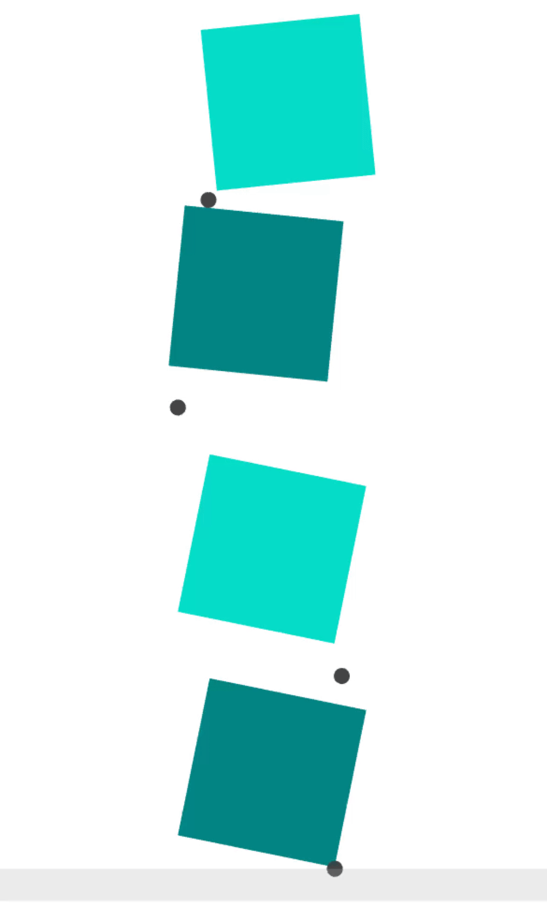
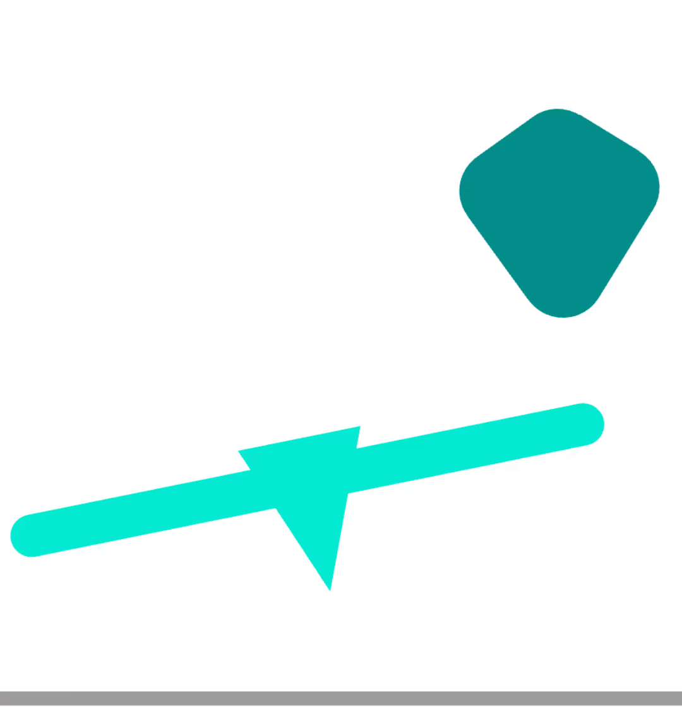

[](https://github.com/simon-lc/Silico.jl/actions/workflows/CI.yml)
[](https://codecov.io/gh/simon-lc/Silico.jl)

# Silico.jl: Single-Level Differentiable Contact Simulation 
Silico allows you to quickly build rigid-body contact simulation environments. It unifies the problem of contact dynamics and the collision detection problem by formulating a single Nonlinear Complementarity Problem (NCP). Silico jointly solves for the contact impact forces, friction forces and the contact point locations. The NCP is solved efficiently using a primal-dual interior point method implemented in [Mehrotra.jl](https://github.com/simon-lc/Mehrotra.jl/). 

It handles collision between ``convex bundles''. A convex bundle is a non-convex shape resulting from the composition of convex shapes through union and Minkowski sum operations. 

For more information, please refer to:
- [paper](https://arxiv.org/abs/2212.06764)
- [slides](https://docs.google.com/presentation/d/1EINBZYLEDYZNOP2v058zQ2EYXNrR924OW6LMX8f75eY/edit?usp=sharing)

## Examples

### Contact-rich manipulation


### Peg-in-hole insertion


### Block stacking


### Polytope drop


### Convex bundle
The light green object is the result of the union of two convex shapes, the dark green shapes results for the Minkowski sum of a polytope and a sphere. 




### Citing 
```
@article{lecleach2022silico,
	title={Single-Level Differentiable Contact Simulation },
	author={Le Cleac'h, Simon and Schwager, Mac and Manchester, Zachary and Sindhwani, Vikas and Florence, Pete and Singh, Sumeet},
	journal={arXiv preprint arXiv:2212.06764},
	year={2022}
}
```
